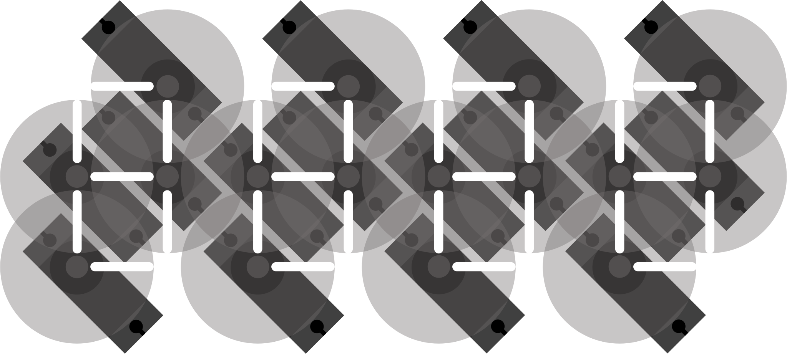

### Idea
This updated version of the DigiLog clock called 'DigiDisk' is meant to improve the previous design but also change a few aspects to meet the following requirements :

+ Use cheap and easily available components
+ Simple setup with as little parts as possible
+ Modular to add more 2-digit assemblies
+ Use overlapping disks to avoid collision of sharp edges and accelerate digit transitions
+ Ditch the WiFi, embrace minimal MCUs
+ Fully assembled PCB (no modules)

### Design
Having overlapping disks with marked pointers instead of bar elements involved changing the axis position and pointers arrangement, and set the disk layer order to draw all 10 digits. With the code names, each digit can be defined by its disks positions. Since the rotating elements are overlapping each other, there is no need to plan the sequence diagram as done for the first version. 

     
  
  &nbsp;&nbsp;&nbsp;&nbsp;&nbsp;
  

## Implementation
### Components
The servo motors are driver by the PCA9685 PWM controller used previously and the time is fetched from the common PCF8563 real-time clock. As the microcontroller of the system only needs to write and read with the two other chips through I2C, the ATtiny402 is very suitable (and my fav). 

+ ATtiny402 microcontroller
+ PCF8563 real-time clock
+ PCA9685 PWM driver
+ 4 x SG90 servo motor

### Schematics

### PCB

### Display

  

### Mechanical parts

### Assembly

### Cost

