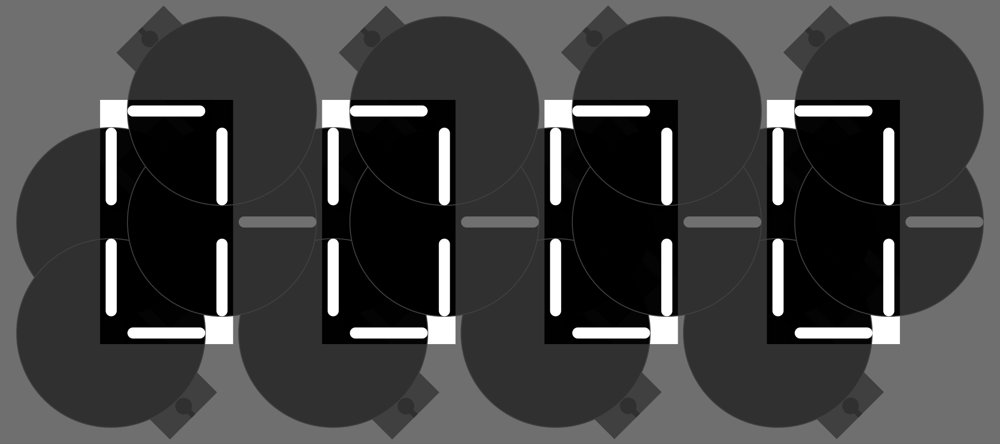
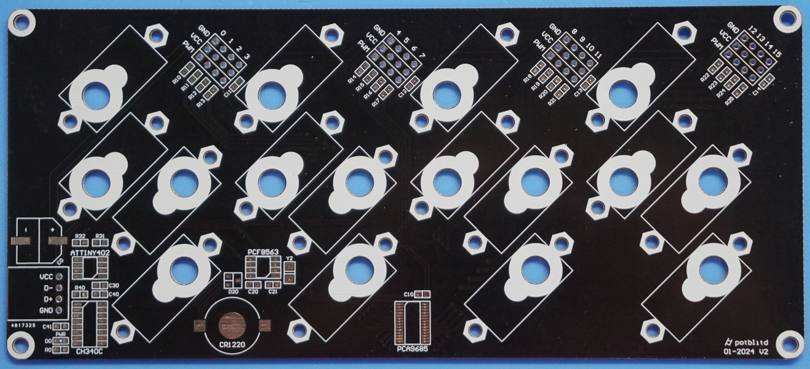
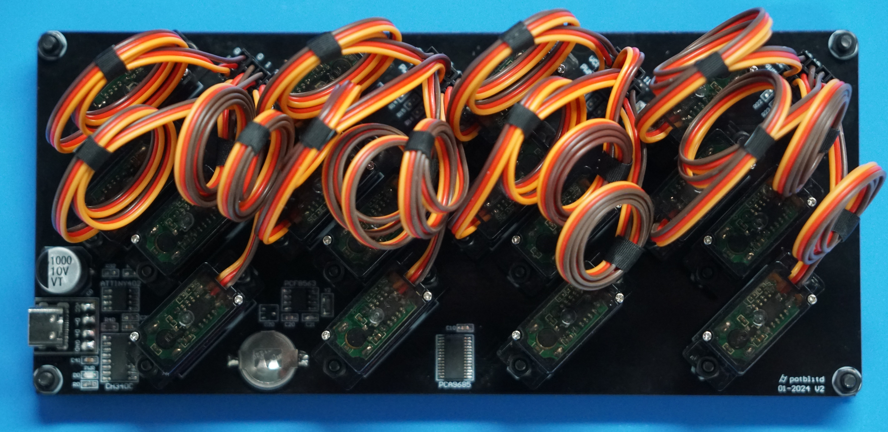
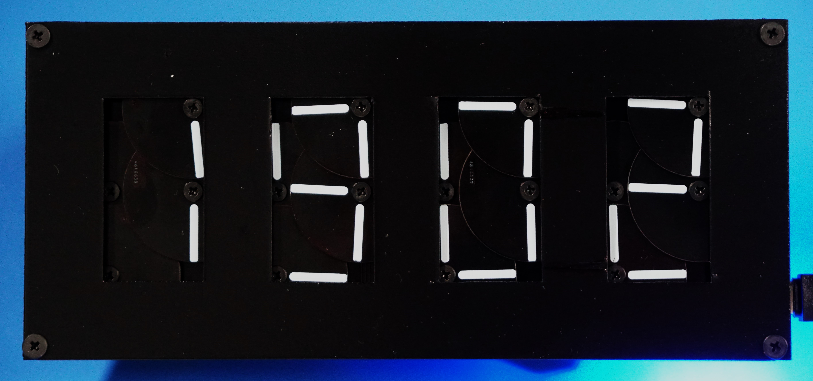

### Idea
This updated version of the DigiLog clock, called 'DigiDisk', is meant to improve the previous design but also change a few aspects to meet the following requirements :

+ Use cheap and easily available components
+ Simple setup with as little parts as possible
+ Full clock, meaning at least 4 digits
+ Use overlapping disks to avoid collision of sharp edges and accelerate digit transitions
+ Ditch the WiFi, embrace minimal MCUs
+ Fully assembled PCB (no modules)
+ Finish version, no more ugly prototypes
+ USB type-C power and programming

### Design
Having overlapping disks with marked pointers instead of bar elements involved changing the 4 axes positions and pointers arrangement, and set the disk layer order to draw all 10 digits. With the code names, each digit can be defined by its disks positions. Since the rotating elements are overlapping each other, there is no need to plan the sequence diagram as done for the first version. This significantly simplifies the coding parts later on.

     
  
  &nbsp;&nbsp;&nbsp;&nbsp;&nbsp;
  

### Components
The servo motors are driver by the PCA9685 PWM controller used previously and the time is fetched from the common PCF8563 real-time clock. As the microcontroller of the system only needs to write and read with the two other chips through I2C, the ATtiny402 is very suitable (and my fav). The servo motors have been upgraded to the MG90S as they are less noisy and their motion is more smooth and precise without a dramatic price increase. For programming the ATtiny over USB, the CH340C is added as it has a simple footprint (SOP-16) and does not require an external oscillator. 

+ ATtiny402 microcontroller
+ CH340C USB to serial
+ PCF8563 real-time clock
+ PCA9685 PWM driver
+ 16 x MG90S servo motor

### Schematics
The system is powered through a USB-C port (on a breakout board) and its status is indicated by a blue LED. For the 16 servo motors, the power supply must be able to provide at least 18W. Programming the ATtiny402 is accomplished through the CH340C chip with the schottky diode between RX and TX to allow UPDI. Somehow, this setup works even without the pull-down resistors on the CC signals, which reduces components and extra connections. The RTC chip has a CR1220 coin cell as an auxilliary power source to keep the time running while unplugged from the USB-C connector. As only one PCA9685 driver is required, its i2C address is hardwired to the default value. 

  

### Display
With the axes position slightly changed from the previous version, the servo also needed to be adjusted but the idea remains the same. In this configuration, two digits must be separated by at least 20mm. The front plate covers the unwanted pointers.  

    
  

### PCB
The board not only integrates all the electronic components, but also includes the mounting holes for the servo motors. In this way, no additonal mounting plates must be manufactured. The outline of the PCB is 80mm high by 180mm wide.

  
  

### Mechanical parts
Since the PCB acts as the mounting plate, only the rotating disks and the front plate must be manufactured. The disks are actually made from thin PCBs with silkscreen pointers as the thickness and material is very suitable. For the front plate, a 1mm PVC board was cut and painted black.

  

### Assembly
All 16 servo motors are mounted to the base PCB with 9mm spacers and long screws. The precise mounting of the servos is crucial to avoid the rotating disks rubbing each other. With 0.8mm thick PCBs for the disks, they are overlaying each other through 1mm spacers, keeping the total height only a little over 5mm. The front plate not being perfectly falt, is mounted on top of the base PCB with 6mm spacers in the corners. 

  
  
  

### Code
The code, written in Arduino, uses librairies [PCA9685](https://github.com/NachtRaveVL/PCA9685-Arduino) and [Rtc_Pcf8563](https://github.com/elpaso/Rtc_Pcf8563). The PWM value for each disk position is established and then, the _set_digit_ function defines the 4 disk positions for every number. In the _setup_ section, the PWM frequency is set and all digits are set to display 0. During the loop, current minute and hour are checked from the real-time clock which are then used to update the digits with the _set_digit_ function.

### Cost
The PCB with all the components costs 50.83 RMB (7.16 USD) and with the 16 servo motors it's 127.31 RMB (17.94 USD). The PCB disks, front plate and all kinds of mounting components come up to 137.62 RMB (19.39 USD). So, the total expenses for this clock are 264.93 RMB (37.33 USD). Since the most expensive items are the PCBs, buying larger quantities would decrease the unit price a lot.

<table>
<tr><th>Electronic parts </th><th>Mechanical parts</th></tr>
<tr><td valign="top">

| Component          | Price/unit  | Quantity  | Cost  |
| ------------------ |------------:|----------:| -----:|
| Base PCB           | 30.230      | 1         | 30.23 |
| ATtiny402          | 3.090       | 1         | 3.09  |
| PCF8563            | 2.000       | 1         | 2.00  |
| PCA9685            | 8.630       | 1         | 8.63  |
| CH340C             | 1.460       | 1         | 1.46  |
| USB-C breakout     | 0.320       | 1         | 0.32  |
| 1000uF capacitor   | 0.706       | 1         | 0.71  |
| 0603 capacitor     | 0.025       | 10        | 0.25  |
| 0603 resisitor     | 0.030       | 20        | 0.60  |
| 0603 LED           | 0.015       | 1         | 0.02  |
| FC-135 crystal     | 1.700       | 1         | 1.70  |
| BAT721C diode      | 0.400       | 1         | 0.40  |
| CR1220 retainer    | 0.050       | 1         | 0.05  |
| CR1220 battery     | 1.120       | 1         | 1.12  |
| 4P 2.54mm header   | 0.022       | 12        | 0.26  |
| MGS90S servo       | 4.780       | 1         | 76.48 |
| **Electronic total** |          |            | **127.31** |

</td><td valign="top">

| Component          | Price/unit  | Quantity  | Cost  |
| ------------------ |------------:|----------:| -----:|
| M2.5*16 servo      | 0.121       | 32        | 3.88  |
| 2.7*7 spacer       | 0.898       | 32        | 28.74 |
| 2.7*2 spacer       | 0.898       | 32        | 28.74 |
| M2.5 nuts          | 0.093       | 32        | 2.97  |
| Disk PCB           | 3.624       | 16        | 57.98 |
| M2.5*4 disk 1      | 0.070       | 4         | 0.28  |
| M2.5*5 disk 2      | 0.070       | 4         | 0.28  |
| M2.5*6 disk 3 & 4  | 0.074       | 8         | 0.59  |
| 2.6*1 spacer       | 0.620       | 8         | 4.96  |
| 2.6*2 spacer       | 0.620       | 8         | 4.96  |
| M3*14 front plate  | 0.117       | 4         | 0.47  |
| M3 nuts            | 0.060       | 4         | 0.24  |
| 3.1*6 spacer       | 0.798       | 4         | 3.19  |
| Front plate board  | 0.332       | 1         | 0.33  |
| **Mechanical total** |           |           | **137.62** |

</td></tr> </table>

