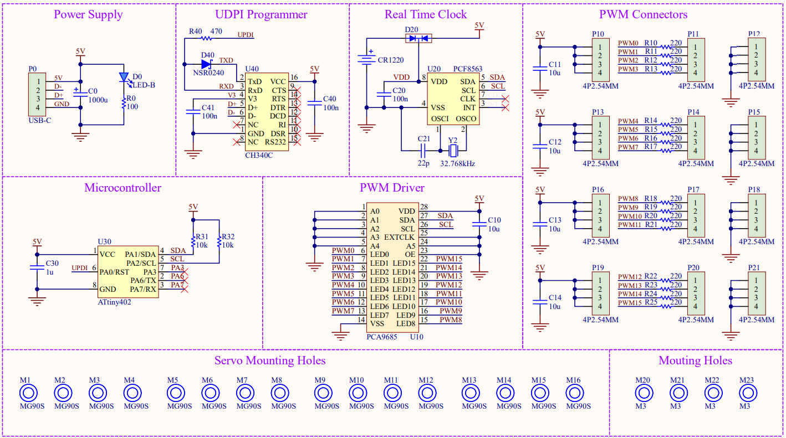

### Idea
This updated version of the DigiLog clock, called 'DigiDisk', is meant to improve the previous design but also change a few aspects to meet the following requirements :

+ Use cheap and easily available components
+ Simple setup with as little parts as possible
+ Full clock, meaning at least 4 digits
+ Use overlapping disks to avoid collision of sharp edges and accelerate digit transitions
+ Ditch the WiFi, embrace minimal MCUs
+ Fully assembled PCB (no modules)
+ Finish version, no more ugly prototypes
+ USB type-C power and programming

### Design
Having overlapping disks with marked pointers instead of bar elements involved changing the 4 axes positions and pointers arrangement, and set the disk layer order to draw all 10 digits. With the code names, each digit can be defined by its disks positions. Since the rotating elements are overlapping each other, there is no need to plan the sequence diagram as done for the first version. This significantly simplifies the coding parts later on.

     
  
  &nbsp;&nbsp;&nbsp;&nbsp;&nbsp;
  

## Implementation
### Components
The servo motors are driver by the PCA9685 PWM controller used previously and the time is fetched from the common PCF8563 real-time clock. As the microcontroller of the system only needs to write and read with the two other chips through I2C, the ATtiny402 is very suitable (and my fav). The servo motors have been upgraded to the MG90S as they are less noisy and their motion is more smooth and precise without a dramatic price increase. For programming the ATtiny over USB, the CH340C is added as it has a simple footprint (SOP-16) and doesn not require an external oscillator. 

+ ATtiny402 microcontroller
+ CH340C USB to serial
+ PCF8563 real-time clock
+ PCA9685 PWM driver
+ 16 x MG90S servo motor

### Schematics
The system is powered through a USB-C port (on a breakout board) and its status is indicated by a blue LED. For the 16 servo motors, the power supply must be able to provide at least 18W. Programming the ATtiny402 is accomplished through the CH340C chip with the schottky diode resistor between RX and TX to allow UPDI. Somehow, this setup works even without the pull-down resistors on the CC signals, which reduces components and extra connections. The RTC chip has a CR1220 coin cell as an auxilliary power source to keep the time running while unplugged from the USB-C connector. As only one PCA9685 driver is required, its i2C address is hardwired to the default value. 

  

### Display
With the axes position slightly changed from the previous version, the servo also needed to be adjusted but the idea remains the same. In this configuration, two digits must be separated by at least 20mm.

  

### PCB
The board not only integrates all the electronic components, but also includes the mounting holes for the servo motors. In this way, no additonal mounting plates must be manufactured. Here, spacers are placed on a long screw to hold the servo in a straight position against the PCB. The precise mounting of the servos is crucial to avoid the rotating disks rubbing each other.

  
  

### Mechanical parts
Since the PCB acts as the mounting plate, only the rotating disks and the front plate must be manufactured. The disks are actually empty PCBs with silkscreen pointers as the thickness and material is very suitable. For the front plate, a 1.5mm wood board was cut and painted black.

### Assembly

  
  

### Code

### Cost
The PCB with all the components costs 59.79 RMB (8.40 USD) and with the 16 servo motors it's 136.27 RMB (19.15 USD). The PCB disks, front plate and all kinds of mounting components come up to 163.79 RMB (23.10 USD). So, the total expenses for this clock are 300.06 RMB (42.32 USD). Since the most expensive items are the PCBs, buying larger quantities would decrease the unit price a lot.

