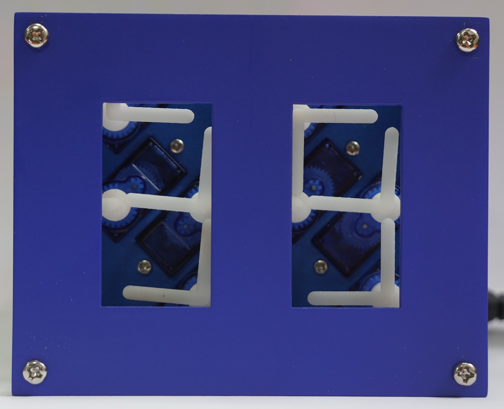
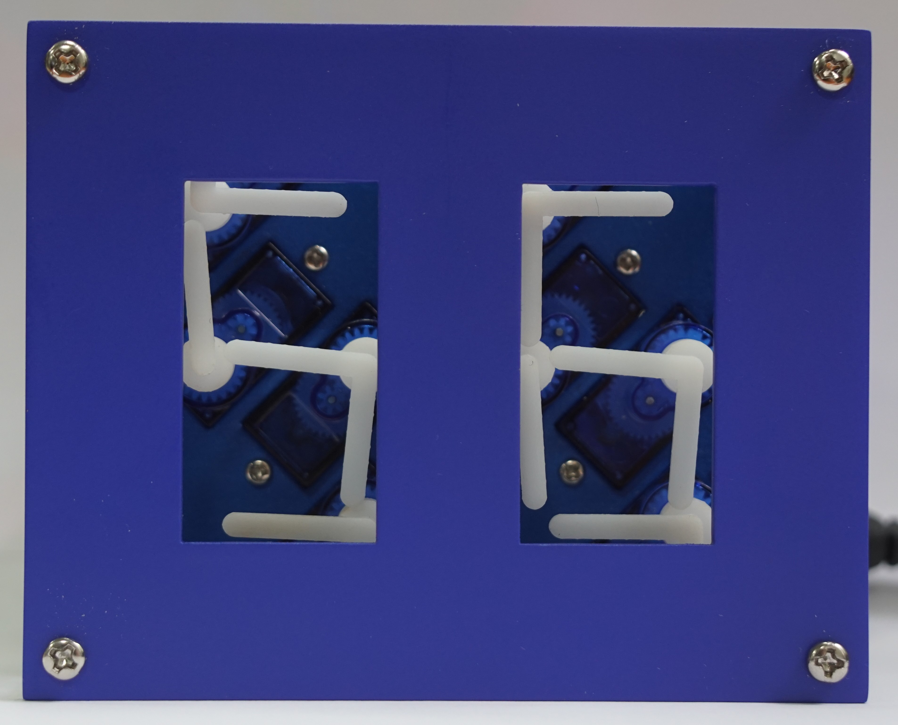

## Concept
There a quite a few articles about electronic projects using a grid arrangement of multiple analog clocks to form a mechanical digital clock such as [this one](http://hackaday.io/project/163582-digital-clock-made-of-analog-clocks). Even though they are visually pleasing with numerous rotating pointers and are definitely interesting engineering projects, these clocks require a lot of dual shaft stepper motors to display just one single number. Also, the use of such an arrangement doesn't allow a clean representation of all the 7-segements digits and the pointers that not used for particular time displays will be hanging around leaving visible lines at random places. Human since 1982, the creator of [A million Times](https://www.humanssince1982.com/a-million-times) claims the copyright over such clock displays.

  

### Idea
The *Concept* part describes the design and movement sequence of my own version of a digital clock composed by multiple analog clocks. The main goal is to first design an interface with the fewest single rotating axes to properly display all 7-segment digits and then, to elaborate the most effective rotations sequence for a counter. Before getting into the design part of the display, a few considerations need to be set based on the future electronic implementation part of this project.
+ For cost saving and program simplification reasons, each axis will have **one rotating element**
+ Located on the same physical plane, the pointers can **not collide or overlap** with each other
+ Driven by servo motors, the analog clocks have a maximum of **180 degrees range**

  

### Design
First of all, to hide out-sticking pointers, the surrounding space outside the digit display will be covered. As the digital clock is displayed by rotating pointers, it is clear that one end of each segment should be attached to an axis. In this way, there can be a maximum of 6 spinning elements. This number can be reduced down to 3 by eliminating the common intersections. Now, such an arrangement would be attractive but unfortunately, it would require a full revolution range and almost always separate turns to compose all the digits. Adding one more rotation point, i.e. 4 altogether, this arrangement needs to be verified to satisfy the design considerations set previously by defining the pointers rotation range.

     
  

By observing the digits 0 to 9, an overview can be obtained of which segments are present for each number, their combinations and transitions. Having only 180 degrees angle of rotation available, three 90-degrees spaced positions have to be defined for each axis. The initial positions are already given from the 8 digit. For the blue pointers, a position completely outside the digit display is needed for a 1 and the one in between, covering the top horizontal segment, for a 2. Similarly from numbers 2 and 4, the rotation range for the green elements can be determined. This is further verified by the fact that both pointers never have to go outside the digit display to compose all the numbers. Digit 1 indicates that the yellow pointer needs one position outside the display and the upper left vertical segment for 0. The remaining two purple positions are simply found from any digits in the sequence. The space coverage for each element and their 3 possible positions are illustrated in the figures below. A label is given to each rotating point as well their positions in order to facilitate notations in the next section.

  

### Sequence
Now that the arrangement of the display is designed, the rotation sequence for each point can be established to perform an ascending counter. At the beginning, each digit is composed with the allowed positions and is named accordingly. Then, transition movements between the numbers are written down. All the pointers start rotating at the same time on the marking of a new count. This condition can not always be satisfied due to possible collisions of two pointers. In this case, the pointer movements are executed shifted from each other in time with the shortest combination. As representations of digits 5 and 9 have two different solutions, the one with the fastest transition or/and the least moving elements is selected. To better understand the rotations of each individual pointer and their respective timings, a sequence diagram is sketched.

     
  

The last step of the sequence part is to make sure that the pointers can display the initial digit 0 from anywhere in the sequence and then go to any digit from there. Here again, some transitions have to be completed with shifted movements to avoid collisions between pointers.

  

Finally, a visual animation is created to get a better understanding of the clock rotations sequence. 

  

## Implementation
### Components
For the electronic part, which basically controls the movements of the rotating pointers, almost only IoT breakout modules are used in order to keep the wiring and programming simple. The main components are listed below.
+ 8 x SG90 servo motor
+ PCA9685 PWM driver
+ 5V2A DC power supply
+ ESP8266 D1 mini dev board
+ DS3231 RTC module

  
  
  
  

The commonly used SG90 servo motor is chosen for this project as it is small, light and cheap. The torque has no particular importance here but its angular speed, which is about 0.15s/90 degrees, is crucial to make sure a digit change is possible every second. In order to drive multiple of these PWM controlled SG90s at the same time, a PCA9685 16-Channel Servo/PWM driver is used. It provides the current-demanding motors with separated 5V from the external DC power supply. The PCA9685 board is controlled through an I2C interface which is communicated from the D1 mini. Finally, a real time clock module is included in the structure to achieve precise digit changes every second or minute.

### Schematics
The servo motors consuming lots of current, their voltage is provided through a barrel connector with the external 5V DC power supply cable. The presence of this voltage is indicated by a blue LED. If, additionally the USB cable is connected to the D1 mini, i.e. for programming the ESP8266, the switch should be positioned accordingly. In either case, VCC of 3.3 volts is generated by the internal LDO of the D1 mini and is indicated by a yellow LED.  
The D1 mini is the microcontroller of the circuit, it communicates with both the PWM driver and the real-time clock through an I2C interface. Four push buttons, used for start & stop, reset and setting the time, are connected to the GPIO pins D5, D6 and D7 which are pulled high internally while D8 is pulled low on the ESP8266 module board. If more than 16 servo motors are used in a setup, another PCA9685 driver can be connected via pin headers P1 or P2. 

  

### Display
In the [Concept](#concept) section, the arrangement of the rotating axes has already been established. Now, the positions of the servo motors are determined so as to set the smallest distance between their shafts. For this, they are tilted at 45 degrees separating their interaxial distance by 20 mm. In this configuration, multiple single digits can be arranged next to each other to form an hour-minute-second clock.  
For this project, the prototype assembly incorporates 8 servos allowing the composition of 2 digits. The outline dimensions are chosen so that the rotating pointers should never exceed the border. Both digits are placed 20 mm apart from each other for convenience. This results in an outline size of 100 mm by 80 mm. The pointers of each rotating axis are arranged as planned out previously and, to hide the ones turning outside of the digit display, a front plate is placed on top.

  
  

### Mechanical parts
The mechanical parts for the assembly were designed in [Tinkercad](https://www.tinkercad.com/). The mounting plate has holes to install the 8 servo motors at their exact position while the purpose of the front plate is to hide out-sticking pointers and only show the digit displays. Both of these plates can be held together by fixing M3 screws in the corners. For the design of the rotating elements, the left pointers had to be higher than the right ones because they overlap with each other in the space between the digit displays.

  
  
  
  
  
  

### PCB
The size of the PCB is the same as the assembly outline so it can be fixed to the mounting plate with M3 standoffs through the mounting holes in the corners. All the components are installed on the top layer of the board. It is also possible to solder the switch, button and LEDs on the bottom layer for a different mounting configuration. D1 mini, DS3231 RTC and PCA9685 PWM Driver are simply plugged into their corresponding female pin headers so that the breakout modules can be removed or inserted easily.

  
  
  

### Assembly
First of all, the 8 servo motors are inserted into their respective holes in the mounting plate and are fixed with small M2 screws. Then, the pointers can be positioned on the turning gear of the servos by sliding them on like a hat. This design is not exactly fitting so the pointers are not perfectly aligned with each other. After soldering all the components to the PCB, it is put together with the mechanical plates by 20 and 25 mm long M3 standoffs. In this configuration, the PCB is facing outwards where the SG90 cables go around the edges to connect into the PWM driver. By turning the PCB inwards and using longer standoffs, the connection cables stay inside the border outline, forming a compact and closed assembly.

  
  
  
  

Next, in the Arduino program, each pointer is configured so that they align as straight as possible. For this, the 3 positions are defined by their average duty cycle value and then, an offset is added for each individual servo. Due to some limitations with this method, not all the pointers could be smoothly aligned here. The rest of the code is straightforward, each transition is defined by the current digit and the next one based on the [sequence](#sequence). The D1 mini continuously checks the current time from the DS3231 RTC and updates the digits on the display.

  
  
  
  

  

For now, the program only displays the current time, but with the four buttons on the back of the PCB, other features could be implemented such as manual time setting, stopwatch, button-press counter or days/hours down-counter. Furthermore, with the on-board ESP8266 WiFi chip, the clock could display any two-digit live number fetched from the internet or from another device, such as a weather station.

