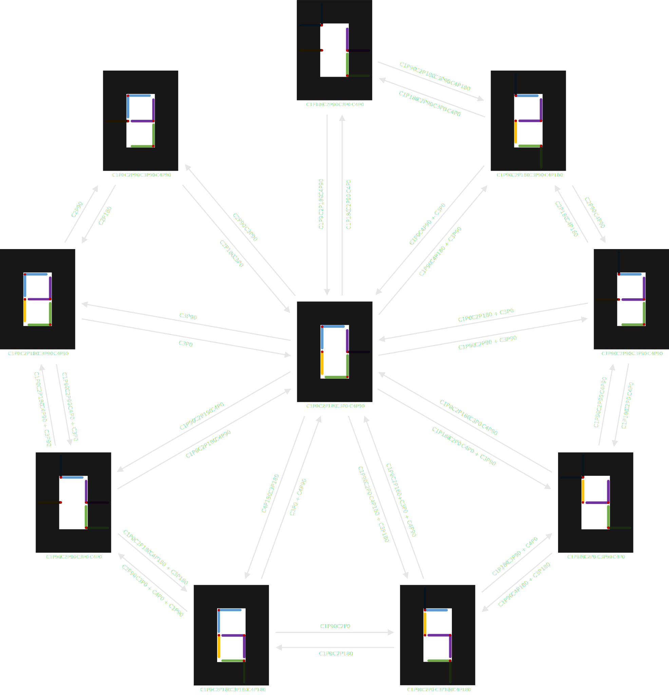

# DigiLog-Clock
## Concept
There a quite a few articles about electronic projects using a grid arrangement of multiple analog clocks to form a mechanical digital clock such as [this one](http://hackaday.io/project/163582-digital-clock-made-of-analog-clocks). Even though they are visually pleasing with numerous rotating pointers and are definitely interesting engineering projects, these clocks require a lot of dual shaft stepper motors to display just one single number. Also, the use of such an arrangement doesn't allow a clean representation of all the 7-segements digits and the pointers that not used for particular time displays will be hanging around leaving visible lines at random places. Human since 1982, the creator of [A million Times](https://www.humanssince1982.com/a-million-times) claims the copyright over such clock displays.

  

### Idea
The *Concept* part describes the design and movement sequence of my own version of a digital clock composed by multiple analog clocks. The main goal is to first design an interface with the fewest single rotating axes to properly display all 7-segment digits and then, to elaborate the most effective rotations sequence for a counter. Before getting into the design part of the display, a few considerations need to be set based on the future electronic implementation part of this project.
+ For cost saving and program simplification reasons, each axis will have **one rotating element**
+ Located on the same physical plane, the pointers can **not collide or overlap** with each other
+ Driven by servo motors, the analog clocks have a maximum of **180 degrees range**

  

### Design
First of all, to hide out-sticking pointers, the surrounding space outside the digit display will be covered. As the digital clock is displayed by rotating pointers, it is clear that one end of each segment should be attached to an axis. In this way, there can be a maximum of 6 spinning elements. This number can be reduced down to 3 by eliminating the common intersections. Now, such an arrangement would be attractive but unfortunately, it would require a full revolution range and almost always separate turns to compose all the digits. Adding one more rotation point, i.e. 4 altogether, this arrangement needs to be verified to satisfy the design considerations set previously by defining the pointers rotation range.

     
  

By observing the digits 0 to 9, an overview can be obtained of which segments are present for each number, their combinations and transitions. Having only 180 degrees angle of rotation available, three 90-degrees spaced positions have to be defined for each axis. The initial positions are already given from the 8 digit. For the blue pointers, a position completely outside the digit display is needed for a 1 and the one in between, covering the top horizontal segment, for a 2. Similarly from numbers 2 and 4, the rotation range for the green elements can be determined. This is further verified by the fact that both pointers never have to go outside the digit display to compose all the numbers. Digit 1 indicates that the yellow pointer needs one position outside the display and the upper left vertical segment for 0. The remaining two purple positions are simply found from any digits in the sequence. The space coverage for each element and their 3 possible positions are illustrated in the figures below. A label is given to each rotating point as well their positions in order to facilitate notations in the next section.

  

### Sequence
Now that the arrangement of the display is designed, the rotation sequence for each point can be established to perform an ascending counter. At the beginning, each digit is composed with the allowed positions and is named accordingly. Then, transition movements between the numbers are written down. All the pointers start rotating at the same time on the marking of a new count. This condition can not always be satisfied due to possible collisions of two pointers. In this case, the pointer movements are executed shifted from each other in time with the shortest combination. As representations of digits 5 and 9 have two different solutions, the one with the fastest transition or/and the least moving elements is selected. To better understand the rotations of each individual pointer and their respective timings, a sequence diagram is sketched.

     
  

The last step of the sequence part is to make sure that the pointers can display the initial digit 0 from anywhere in the sequence and then go to any digit from there. Here again, some transitions have to be completed with shifted movements to avoid collisions between pointers.

  

Finally, a visual animation is created to get a better understanding of the clock rotations sequence. 

  

## Implementation
### Components
For the electronic part, which basically controls the movements of the rotating pointers, almost only IoT breakout modules are used in order to keep the wiring and programming simple. The main components are listed below.
+ 8 x SG90 servo motor
+ PCA9685 PWM driver
+ 5V2A DC power supply
+ ESP8266 D1 mini dev board
+ DS3231 RTC module

  
  
  
  

