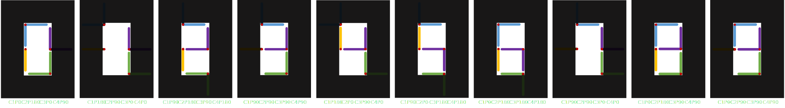
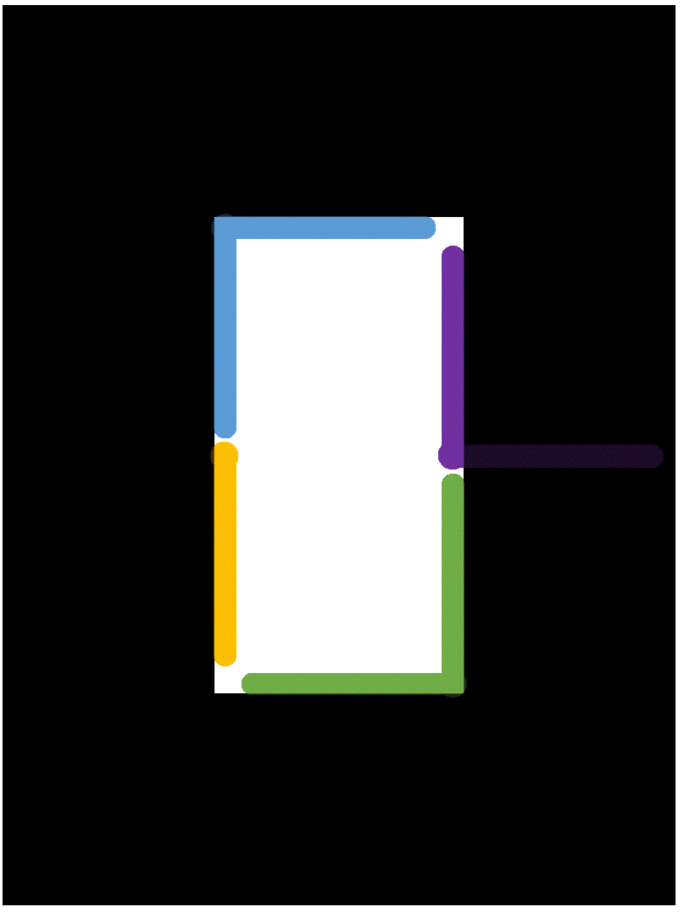
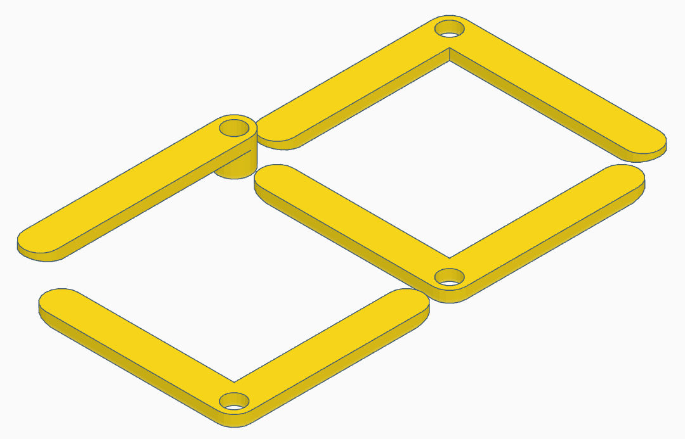
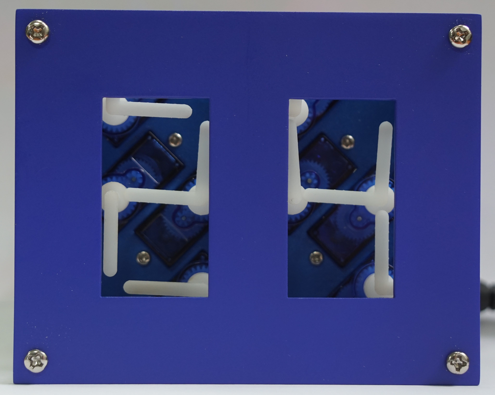

  

## Concept
There a quite a few articles about electronic projects using a grid arrangement of multiple analog clocks to form a mechanical digital clock such as [this one](http://hackaday.io/project/163582-digital-clock-made-of-analog-clocks). Even though they are visually pleasing with numerous rotating pointers and are definitely interesting engineering projects, these clocks require a lot of dual shaft stepper motors to display just one single number. Also, the use of such an arrangement doesn't allow a clean representation of all the 7-segements digits and the pointers that are not used for particular time displays will be hanging around leaving visible lines at random places. The *Concept* part describes the design and movement sequence of my own version of a digital clock composed by multiple analog clocks.

  

### Idea
The main goal is to first design an interface with the fewest single-shaft rotating axes to properly display all 7-segment digits and then, to elaborate the most effective rotations sequence to create a counter. Before getting into the design part of the display, a few considerations need to be set based on the future electronic implementation part of this project.
+ For cost saving and program simplification, each axis will have **one rotating element**
+ Located on the same physical plane, the pointers can **not collide or overlap** with each other
+ Driven by servo motors, the rotating elements have a maximum of **180 degrees range**
<!--

 
  

-->
### Design
First of all, to hide out-sticking pointers, the surrounding space outside the digit display will be covered. As the digital clock is displayed by rotating pointers, it is clear that one end of each segment should be attached to an axis. In this way, the arrangement with the least rotating elements that also meets the requirements set above is sketched below. Each element and its possibles position have been given a code combination to facilitate the movements sequence design and coding.
<!-- 

      
   

 By observing the digits 0 to 9, an overview can be obtained of which segments are present for each number, their combinations and transitions. Having only 180 degrees angle of rotation available, three 90-degrees spaced positions have to be defined for each axis. The initial positions are already given from the 8 digit. For the blue pointers, a position completely outside the digit display is needed for a 1 and the one in between, covering the top horizontal segment, for a 2. Similarly from numbers 2 and 4, the rotation range for the green elements can be determined. This is further verified by the fact that both pointers never have to go outside the digit display to compose all the numbers. Digit 1 indicates that the yellow pointer needs one position outside the display and the upper left vertical segment for 0. The remaining two purple positions are simply found from any digits in the sequence. The space coverage for each element and their 3 possible positions are illustrated in the figures below. A label is given to each rotating point as well their positions in order to facilitate notations in the next section. -->

     
  

### Sequence
With the code name for each digit representation, the transition movements between them can are written down. For a conventional clock, transitions for counting up and displaying digit 0 from any number and to any number from 0 must be considered. Sometimes, not all the rotating elements can perform the necessary movements simultaneously due to possible collisions of two pointers. In this case, the rotations are executed consecutively in the shortest possible timeframe. 

  
  &nbsp;&nbsp;&nbsp;&nbsp;&nbsp;&nbsp;&nbsp;&nbsp;&nbsp;&nbsp;
  

## Implementation
### Components
For the electronic part, which basically controls the movements of the rotating elements, almost only breakout modules are used in order to keep the assembly and programming simple. The main components for one display are listed below.
+ 4 x SG90 servo motor
+ PCA9685 PWM driver
+ 5V2A DC power supply
+ ESP8266 D1 mini dev board
+ DS3231 RTC module

  
  
  
  

The commonly used SG90 servo motor is chosen for this project as it is small, light and cheap. The torque has no particular importance here but its angular speed, which is about 0.15s/90 degrees, is crucial to make sure a digit transition is possible every second. In order to drive multiple of these SG90s simultaneously, a PCA9685 16-Channel Servo/PWM driver is used. It provides the current-demanding motors with separated 5V from the external DC power supply and is controlled through an I2C interface which is communicated from the D1 mini. Finally, a real time clock module is included in the system to achieve good time accuracy.

### Schematics
The servo motors consuming lots of current, their voltage is provided through a barrel connector with the external 5V DC power supply cable. The presence of this voltage is indicated by a blue LED. If, additionally the USB cable is connected to the D1 mini, i.e. for programming the ESP8266, the switch should be positioned accordingly. In either case, VCC of 3.3 volts is generated by the internal LDO of the D1 mini and is indicated by a yellow LED.  
The D1 mini is the microcontroller of the circuit, it communicates with both the PWM driver and the real-time clock through an I2C interface. Four push buttons, used for start & stop, reset and setting the time, are connected to the GPIO pins D5, D6 and D7 which are pulled high internally, and D8 which is pulled low on the ESP8266 module board. If more than 16 servo motors are used in a setup, another PCA9685 driver can be connected via the additional pin headers P1 or P2. 

  

### Display
In the [Concept](#concept) section, the arrangement of the rotating axes has already been established. Now, the positions of the servo motors are determined so as to set the smallest distance between their shafts. For this, they are tilted at 45 degrees separating their interaxial distance by 20 mm. In this configuration, multiple single digits can be arranged next to each other to form an hour-minute-second clock.  
For this project, the prototype assembly incorporates 8 servos allowing the composition of 2 digits. The outline dimensions are chosen so that the rotating pointers should never exceed the border. Both displays are placed 20 mm apart to avoid interfering each other. This results in an outline size of 100 mm by 80 mm. To hide the pointers turning outside of the digit display, a front plate is placed on top.

  
  

### Mechanical parts
The mechanical parts for the assembly were designed in [Tinkercad](https://www.tinkercad.com/). One plate is used to precisely mount the 8 servo motors and another plate as the front cover. Both plates can be held together by fixing M3 screws in the corners. For the design of the rotating elements, the left pointers had to be higher than the right ones because they overlap with each other in the space between the digit displays.

  
  
  
  <!--  -->
  
  <!--  -->

### PCB
The PCB has the same size as the assembly outline so it can be fixed to the mounting plates with M3 standoffs. All the components are installed on the top layer of the board. It is also possible to solder the switch, button and LEDs on the bottom layer for a different mounting configuration. Modules D1 mini, DS3231 RTC and PCA9685 PWM driver are simply plugged into their corresponding female pin headers so that they can be removed or inserted easily.

  
  
  

### Assembly
The 8 servo motors are inserted into their respective holes in the mounting plate and are fixed with small M2 screws. Then, the pointers can be positioned on the turning gear of the servos by sliding them on like a hat. This design is not exactly fitting so the pointers are not perfectly aligned with each other. After soldering all the components to the PCB, it is mounted onto the plates. In this configuration, the PCB is facing outwards where the SG90 cables go around the edges to connect into the PWM driver. By turning the PCB inwards, the connection cables stay inside the border outline, forming a more compact and closed assembly.

  
  
  
  

### Code
In the Arduino program, the positions for each rotating element is configured so that they align as straight as possible. Due to some fabrication inaccuracies and angle precision limitations, not all the pointers could be smoothly aligned here. For the rest of the code, each transition is defined by the current digit and the next one based on the [sequence](#sequence). The D1 mini checks the current time from the DS3231 RTC and updates the digits on the display.

  
  
  
  

### Cost
All parts were cheaply bought on Taobao with negligible delivery as most items have free shipping and/or the charges vary depending on the delivery address. Unit prices for LEDs, capacitor, resistors and pin headers were approximated. The mechanical parts were quite expensive but are very good quality. The total price sums up to 322.71 RMB (45.45 USD).

### Future improvements
The prototype assembly accomplishes its proof-of-concept perfectly fine, the servo transitions are fast and precise enough to beautifully display digits without collisions between pointers. However, there a few improvements to note for the code or for a future version.
+ To actually act as a clock and display the time, there should be at least 4 digits for minutes and hours. Having another pair of digits for the seconds could also be considered but each servo movement is noisy and can be bothering. Up to 16 servos can be driven by the PCA9685 and so, one PCB is sufficient.
+ The corners of the mechanical plates can be rounded to cover only the rotating pointers and thus reducing the size. This would also give the clock a better aesthetic.
+ Reading the digits requires a direct line of sight on the assembly because the front plate can hide the pointers when observing the clock from an angle. This can easily be corrected by mounting the front plate as close as possible to the pointers.
+ The four buttons on the back of the PCB could be implemented to add other features such as manual time setting, stopwatch, button-press counter or days/hours down-counter.
+ With the on-board ESP8266 WiFi chip, the clock could display live number fetched from the internet or from another device, such as a weather station.
